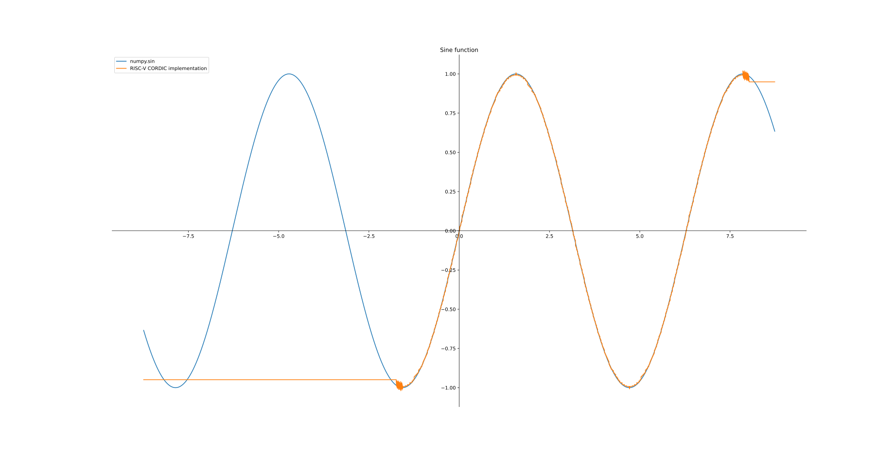
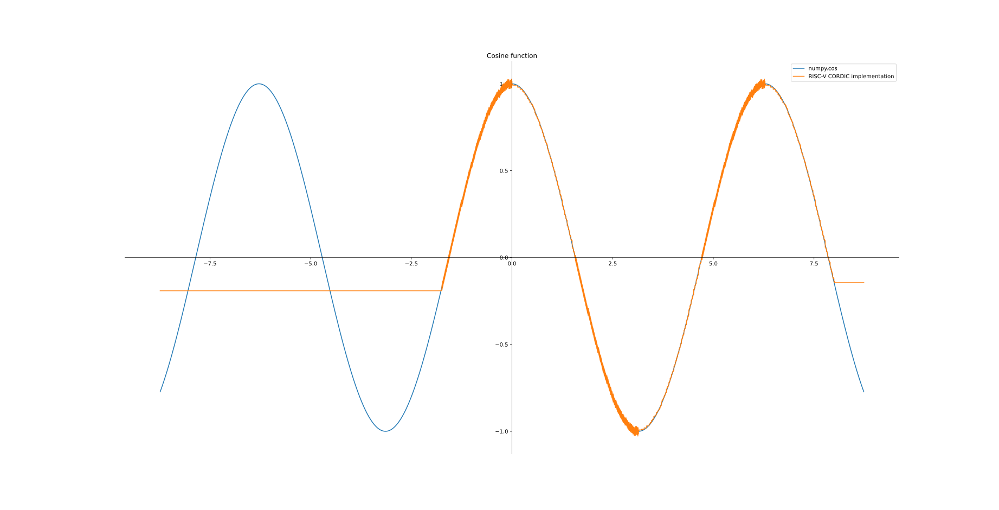

## RISC-V CORDIC Implementation

Simple algorithm for approximating sine and cosine of given degree written in pure RISC-V assembly. It uses fixed point arithmetic - the smallest unit is 1/256. You should represent your argument as `degree*256` and scale down the return values dividing by 256.

Floating-Point extension is **not required** - it should work even on RV32I ISA.

**Don't use it in your project if it's somewhat important. This implementation may contain bugs!**

I wrote this in my 5th day of learning RISC-V assembly in [RARS](https://github.com/TheThirdOne/rars) and tested it on a [Fedora virtual machine](https://fedoraproject.org/wiki/Architectures/RISC-V/Installing) using [QEMU](https://github.com/qemu/qemu) in [GAS](https://en.wikipedia.org/wiki/GNU_Assembler).

The algorithm is basically a modified version the one shown in this awesome [paper](https://bsvi.ru/uploads/CORDIC--_10EBA/cordic.pdf).

## Usage from C

`cordic` routine in assembly returns normally the value of sin in `a0` and cos in `a1` to avoid allocating space in the system memory. This means that you can get only the value of sin using plain C.

To get the value of cos I used the `register` property which allows the C language to access `a1` after the function is called. (see `main.c`)

## Benchmarks and Figures

This piece of assembly is clearly not written for benchmarking purposes rather for learning but you can check it anyway using `bench.c` .

```shell
$ ./bench 
Cordic asm took: 34.686128 ms
For: 256321 iterations
C math library took: 161.709872 ms
For: 256694 iterations
```



